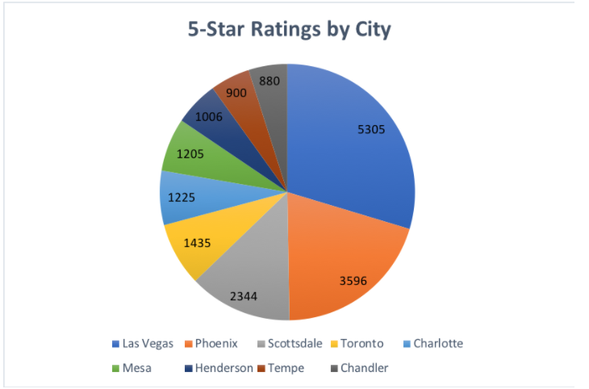
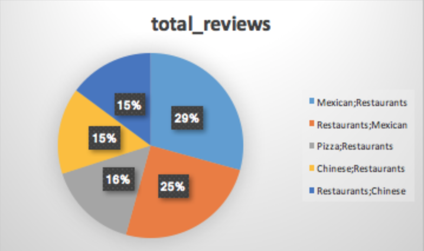
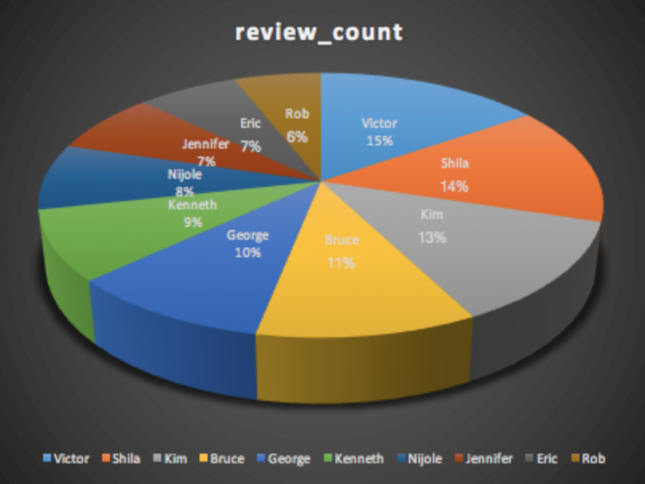

# Group 6 Project
Group 6, Katherine Matthers, Akina Hays, Aiqi Chen, Yingjin Wang. We used 3 different datasets in this project.

## Description of datasets.yelp_business
This table includes various data gathered on Yelp including users, reviews, ratings, business addresses and catergories.

## Question #1
What are the top 5 states with the most 5 star businesses? 

```sql
Select count(stars) as count_of_5_stars, state
From datasets.yelp_business
where stars = 5
group by state
order by count_of_5_stars DESC
```


## Question #2
What are the top 5 cities with the most 5 star businesses? Limit visualization to 10.

```sql
Select count(stars) as count_of_5_stars, city
From datasets.yelp_business
where stars = 5
group by city
order by count_of_5_stars DESC
```



## Question #3
What are the top 5 businesses with the most reviews?

```sql
Select sum (review_count) as count_of_reviews, name
From datasets.yelp_business
group by name
order by count_of_reviews DESC
limit 50
```


## Question #4
What are the top category businesses most people review for?

```sql
Select sum(review_count) as total_reviews, categories
From datasets.yelp_business
Group by categories
Order by total_reviews DESC
Limit 5
```



## Question #5
What are the most one star review business from yelp?

```sql
SELECT name,stars, review_count
FROM datasets.yelp_business
where stars=1
group by name, stars, review_count
limit 10
```


## Question #6
How many businesses are open?

```sql
SELECT count(is_open) as business_open
from datasets.yelp_business
where is_open = 1
```

## Question #7
What is the average stars of each states?

```sql
Select  AVG(stars) as average_stars, state
From datasets.yelp_business
group by state
```

## Description of datasets.yelp_user
This table includes information describing Yelp users such as, their name, when they joined yelp, how many reviews they have written and characteristics of the reviews.

## Question #8
How many people joined yelp over the course of the year 2017?

```sql
SELECT count(name) as count_name, yelping_since
from datasets.yelp_user
where yelping_since between '2017-01-01' and '2017-12-31'
group by yelping_since
order by yelping_since ASC
```


## Question #9 
Who are the top 10 users wrote the most reviews?

```sql
 SELECT review_count, name
FROM datasets.yelp_user
order by review_count DESC 
limit 10
```



## Description of datasets.yelp_checkin
This table includes the amount of check-ins each business has and when that check-in was. Check-ins are offer rewards that businesses give customers they “check-in” to the business on Yelp. By using the check-in feature on the Yelp, customers broadcast to their friends on Yelp that they're at your business.

## Quesition #10

```sql
SELECT business_id,
count (checkins) as check_in
from datasets.yelp_checkin
group by business_id
order by check_in DESC
limit 5
```


